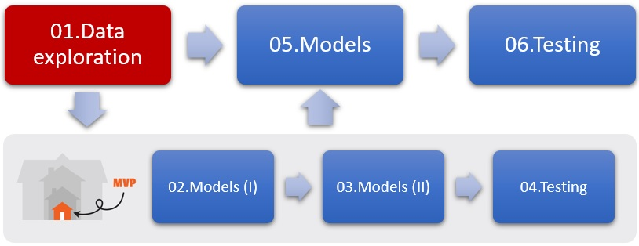

# TFM Customer Churn Prediction


### Objetivo

Proyecto de Machine Learning cuya finalidad es predecir la probabilidad de baja de cada cliente de una empresa que instala calderas en inmuebles para la producción energética, vendiendo posteriormente también el combustible necesario para su funcionamiento.


### Guía rápida

1. Clonar el repositorio manteniendo la estructura de carpetas y su contenido.
2. Copiar en la carpeta `data` los archivos de **portfolio** y los 2 de **test**.
3. Ejecutar los notebooks en el orden por el que están nombrados.
    - MVP: Los notebooks 2, 3 y 4 han sido creados a modo de MVP, sobre los que se han realizado las iteraciones con un subconjunto del dataset para ser finalmente aplicados sobre todos los datos, por lo que son posibles 2 itinerarios de ejecución: 
  
  

      
    
4. Frontend: Navegar mediante la terminal hasta la carpeta `notebooks` y ejecutar el siguiente comando:

    ```
    streamlit run app.py
     ```